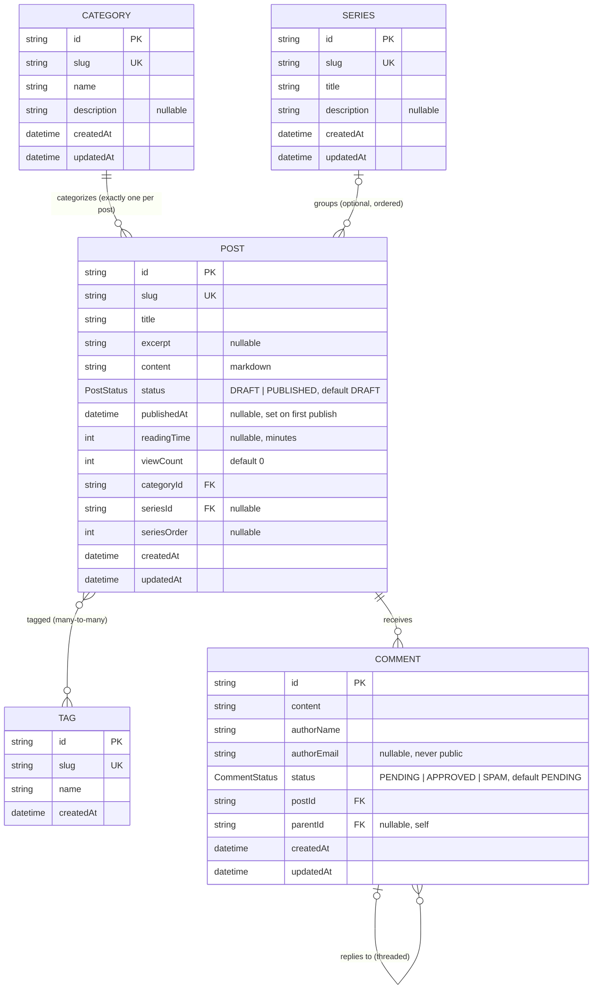

# Domain Model

The quizas domain, as an entity-relationship model. This is derived from the
persistence schema (`apps/api/prisma/schema.prisma`) and expresses the same
intent as [`../spec/README.md` §3 Domain Concepts](../spec/README.md#3-domain-concepts)
and the integrity rules in [`../spec/policies.md` §5.3](../spec/policies.md#53-relationships--integrity).

There are **five aggregate roots** — each with an independent lifecycle and its
own API resource — documented one per file:

- [`post.md`](./post.md) — **Post** (the central aggregate)
- [`category.md`](./category.md) — **Category**
- [`tag.md`](./tag.md) — **Tag**
- [`series.md`](./series.md) — **Series**
- [`comment.md`](./comment.md) — **Comment**

## Full ERD

## Relationships & cardinality

| From | To | Cardinality | Notes |
|---|---|---|---|
| Category | Post | 1 — 0..* | Every post has **exactly one** category (`categoryId` required). No cascade — a category with posts cannot be deleted until reassigned. |
| Series | Post | 0..1 — 0..* | A post belongs to **at most one** series; membership is optional and detachable. `seriesOrder` is its position. Deleting a series nulls its posts' `seriesId`. |
| Post | Tag | 0..* — 0..* | Many-to-many via implicit join (`PostTags`). |
| Post | Comment | 1 — 0..* | `onDelete: Cascade` — deleting a post deletes its comments. |
| Comment | Comment | 0..1 — 0..* | Self-relation (`CommentReplies`). A reply has one parent; `onDelete: Cascade` — deleting a parent deletes its replies. A reply must be on the **same post** as its parent. |

## Enums

- **`PostStatus`**: `DRAFT`, `PUBLISHED` (default `DRAFT`).
- **`CommentStatus`**: `PENDING`, `APPROVED`, `SPAM` (default `PENDING`).

## Legend

- **PK** — primary key (`cuid` string). **UK** — unique key. **FK** — foreign key.
- Crow's-foot: `||` exactly one · `|o` zero-or-one · `o{` zero-or-many.
- "nullable" marks optional (`?`) attributes; all `createdAt`/`updatedAt` are
  timestamps (`updatedAt` auto-maintained; **Tag has no `updatedAt`**).
