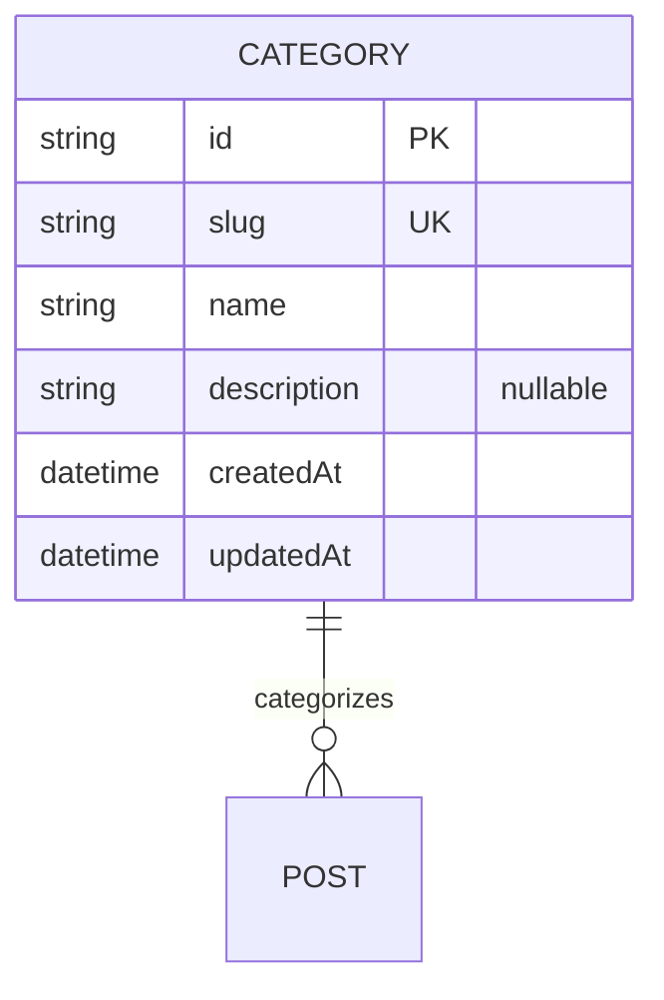

# Category — aggregate root

A broad, mutually-exclusive bucket for posts (e.g. *개발 / 일상 / 에세이*). See the
[full ERD](./README.md).

## Attributes

| Field | Type | Optional | Notes |
|---|---|---|---|
| `id` | string (cuid) | — | PK |
| `slug` | string | — | **Unique**, URL-safe. |
| `name` | string | — | Display name. |
| `description` | string | ✓ | Optional blurb shown on the category archive. |
| `createdAt` / `updatedAt` | datetime | — | Timestamps. |

## Relations

- **Posts (0..*):** a category groups many posts; each post references exactly one
  category. No cascade.

## Invariants & rules

- Slug is **unique** and URL-safe ([§5.2](../spec/policies.md#52-identifiers)).
- Every post must reference a category, so a category **cannot be deleted while it
  still has posts** — they must be reassigned first (enforced as a `409` at the
  API). This upholds "a post always has exactly one category"
  ([§5.3](../spec/policies.md#53-relationships--integrity)).
- Category archives list **published posts only**
  ([§4.3](../spec/functional.md#43-taxonomy)).
