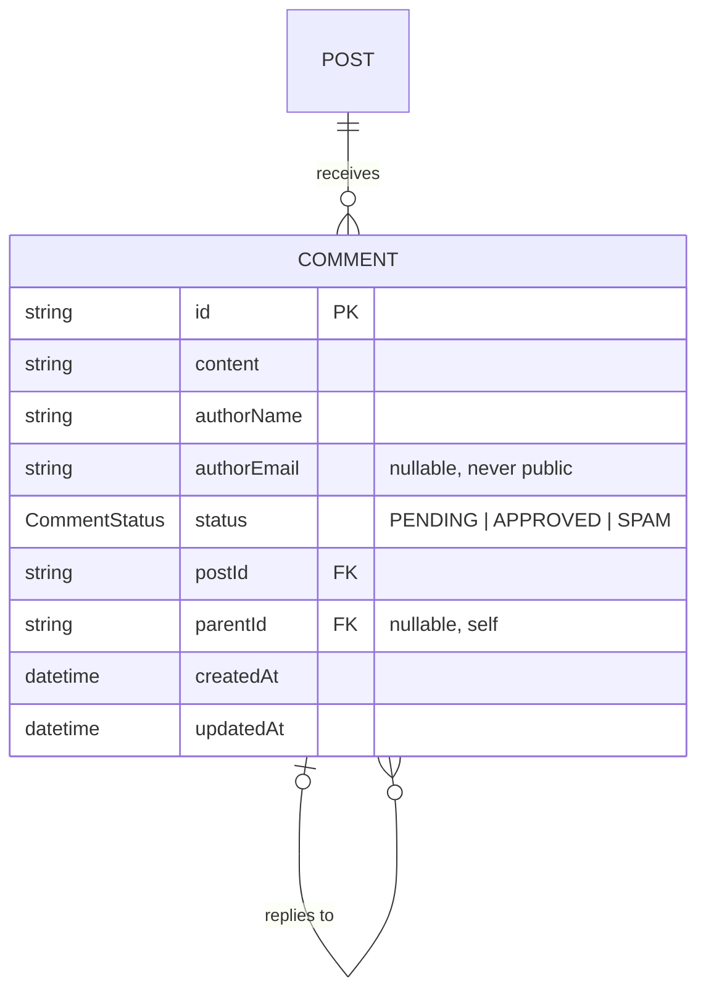

# Comment — aggregate root

A reader's response attached to a published post; threaded and always moderated.
See the [full ERD](./README.md).

## Attributes

| Field | Type | Optional | Notes |
|---|---|---|---|
| `id` | string (cuid) | — | PK |
| `content` | string | — | Body; length-capped (≤ 5000). |
| `authorName` | string | — | Display name; length-capped (≤ 50). |
| `authorEmail` | string | ✓ | Valid email if given; **never exposed publicly**. |
| `status` | `CommentStatus` | — | `PENDING` (default), `APPROVED`, or `SPAM`. |
| `postId` | string | — | FK → Post (**required**). |
| `parentId` | string | ✓ | FK → Comment (self); null for top-level. |
| `createdAt` / `updatedAt` | datetime | — | Timestamps. |

## Relations

- **Post (required, 1):** every comment belongs to one post; `onDelete: Cascade`.
- **Parent comment (optional, 0..1):** a reply points to one parent; replies
  cascade-delete with the parent (`CommentReplies`).

## Invariants & rules

- Comments may only be submitted on **published** posts
  ([§5.4](../spec/policies.md#54-comments)).
- Every new comment starts **`PENDING`** and is invisible to the public until the
  author approves it — there is no auto-approval.
- A reply may only attach to a comment **on the same post**
  ([§5.3](../spec/policies.md#53-relationships--integrity)); a mismatch is rejected.
- `authorEmail` exists only for the author's moderation/notification and is
  **never** returned on public surfaces.
- Public post responses expose only approved comments, projected to
  `{ id, content, authorName, createdAt, parentId }`.

## Indexes

`@@index([postId, status])`, `@@index([parentId])`.
