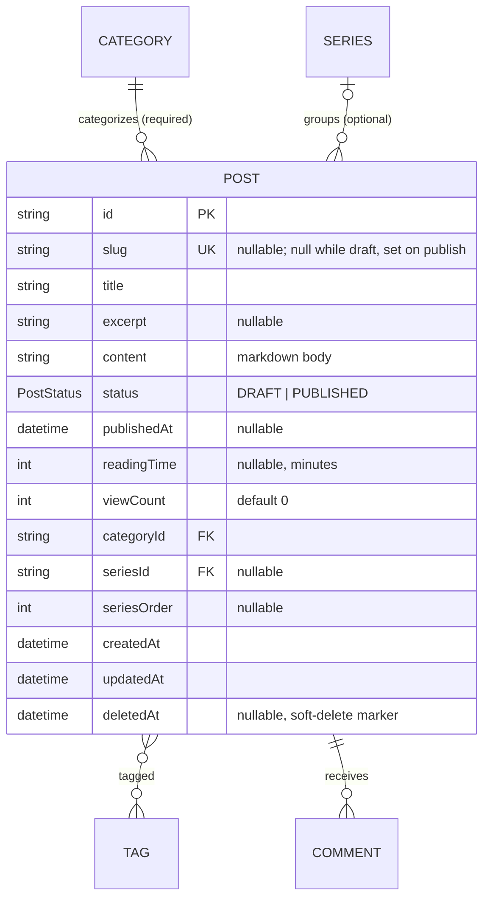

# Post — aggregate root

The central unit of content and the aggregate everything else references. See the
[full ERD](./README.md) and [spec §3](../spec/README.md#3-domain-concepts).

## Attributes

| Field | Type | Optional | Notes |
|---|---|---|---|
| `id` | string (cuid) | — | PK |
| `slug` | string | ✓ | **Unique** (nullable). `null` while draft; generated from the title on publish and suffix-deduped on collision. URL-safe; may contain Hangul. |
| `title` | string | — | Required. |
| `excerpt` | string | ✓ | Short summary for list views. |
| `content` | string | — | Markdown; images embedded inline by reference. |
| `status` | `PostStatus` | — | `DRAFT` (default) or `PUBLISHED`. |
| `publishedAt` | datetime | ✓ | Stamped once, on first publish. |
| `readingTime` | int | ✓ | Minutes (~200 wpm, min 1); computed on save. |
| `viewCount` | int | — | Default 0. |
| `categoryId` | string | — | FK → Category (**required**). |
| `seriesId` | string | ✓ | FK → Series (optional). |
| `seriesOrder` | int | ✓ | Position within the series (≥ 0). |
| `deletedAt` | datetime | ✓ | Soft-delete marker; `null` = live. When set, the post is hidden everywhere and retained for recovery. |

## Relations

- **Category (required, 1):** exactly one per post.
- **Series (optional, 0..1):** at most one; detachable without deleting the post.
- **Tags (0..*):** many-to-many (`PostTags`).
- **Comments (0..*):** owned; `onDelete: Cascade`.

## Invariants & rules

- A post always has **exactly one** category ([§5.3](../spec/policies.md#53-relationships--integrity)).
- Slug is **service-managed**: `null` while the post is a draft, generated from
  the title on publish, and made **unique** by appending a numeric suffix on
  collision (never rejected). It may change when the title changes
  ([§5.2](../spec/policies.md#52-identifiers)).
- **Drafts are private** — never listed or reachable by a reader on any surface,
  including by direct slug ([§5.1](../spec/policies.md#51-content-visibility)).
- Public listings are ordered newest-first by `publishedAt`.
- Deletion is a **soft delete**: `remove` sets `deletedAt` and rewrites the slug
  to release it, rather than deleting the row. A post with `deletedAt` set is
  excluded from every read (lists, detail, counts, series/category/tag pages) for
  readers and the author alike, and its comments go with it. The `onDelete:
  Cascade` on comments only matters if a row is ever physically purged
  ([§5.3](../spec/policies.md#53-relationships--integrity)).

## Indexes

`@@index([status, publishedAt])`, `@@index([categoryId])`, `@@index([seriesId])`;
unique on `slug` (nullable — Postgres allows many `NULL`s, so drafts don't collide).
