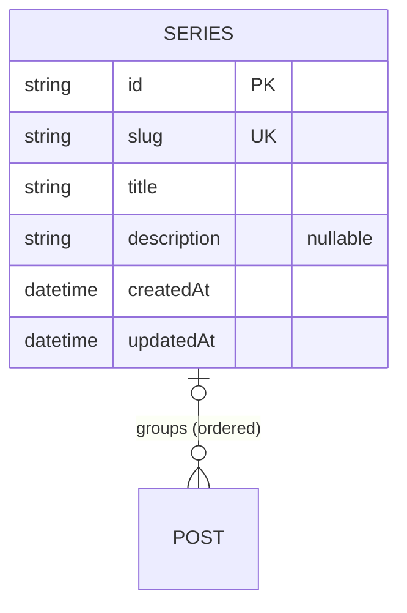

# Series — aggregate root

An ordered collection of posts telling a longer story across multiple parts. See
the [full ERD](./README.md).

## Attributes

| Field | Type | Optional | Notes |
|---|---|---|---|
| `id` | string (cuid) | — | PK |
| `slug` | string | — | **Unique**, URL-safe. |
| `title` | string | — | Series title. |
| `description` | string | ✓ | Optional blurb shown on the series page. |
| `createdAt` / `updatedAt` | datetime | — | Timestamps. |

## Relations

- **Posts (0..*):** a series groups zero or more posts. A post belongs to **at most
  one** series (`Post.seriesId` optional) and carries a `seriesOrder` position.

## Invariants & rules

- Slug is **unique** and URL-safe ([§5.2](../spec/policies.md#52-identifiers)).
- Series membership is **optional and detachable** — a post can leave a series
  without being deleted ([§5.3](../spec/policies.md#53-relationships--integrity)).
- **Deleting a series does not delete its posts**; their `seriesId` is nulled.
- Reader-facing series pages list posts **in author-defined order**
  ([§4.4](../spec/functional.md#44-series)), published only.
