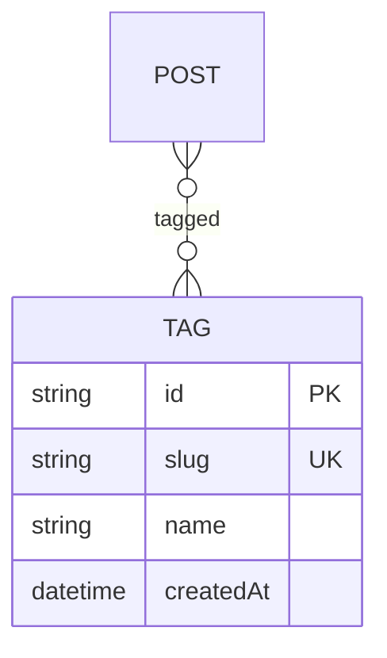

# Tag — aggregate root

A cross-cutting topic label applied across many posts. See the
[full ERD](./README.md).

## Attributes

| Field | Type | Optional | Notes |
|---|---|---|---|
| `id` | string (cuid) | — | PK |
| `slug` | string | — | **Unique**, URL-safe. |
| `name` | string | — | Display name, rendered as `#name`. |
| `createdAt` | datetime | — | Timestamp. **No `updatedAt`** on this model. |

## Relations

- **Posts (0..*):** many-to-many via the implicit `PostTags` join. A post may carry
  zero or more tags; a tag spans many posts.

## Invariants & rules

- Slug is **unique** and URL-safe ([§5.2](../spec/policies.md#52-identifiers)).
- Tag archives list **published posts only**
  ([§4.3](../spec/functional.md#43-taxonomy)).
- Deleting a tag removes its join rows only; posts are untouched.
